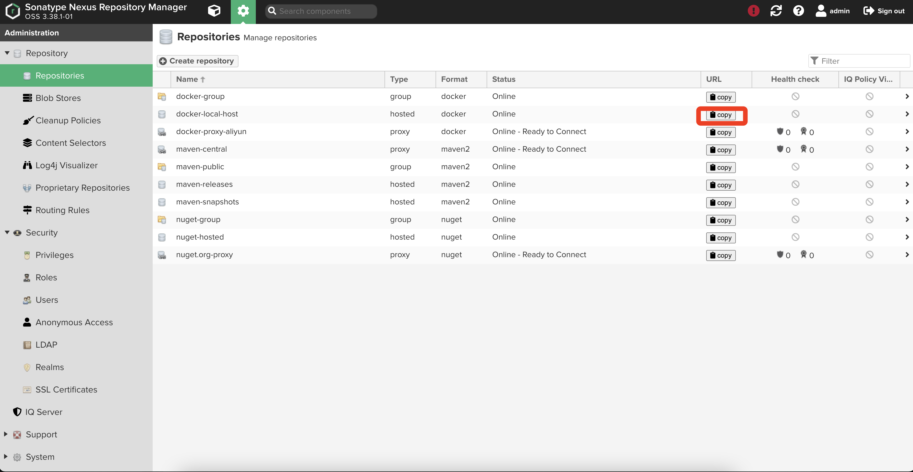
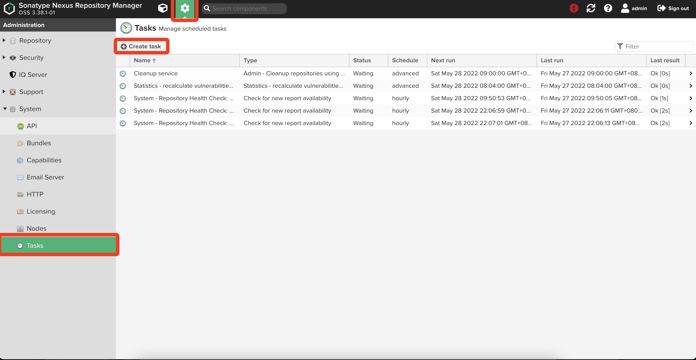
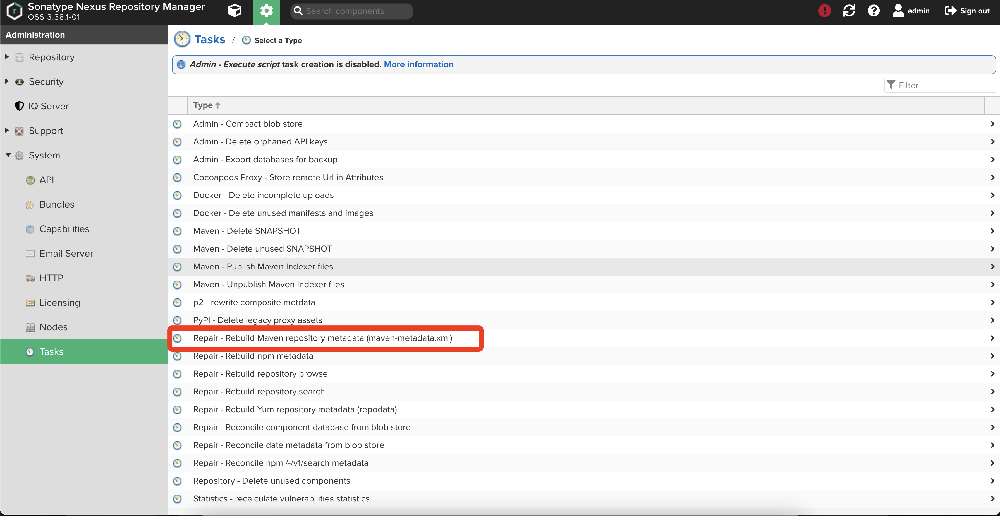

[TOC]

# 一. 前言

​		在离线环境（与物联网物理隔离的私网）中实施项目，很多时候能够有一个远程debug环境是心情很愉悦的。往往在私网中搭建开发/debug环境很费尽，一是准备开发环境（idea、jdk、maven等开发工具），此工作虽然繁杂但却一劳永逸；二是maven依赖的拷贝工作繁杂且无法做到一劳永逸。所以快速的管理私有网中的maven构建往往能够有效的提升工作效率。


# 二. 搭建nexus服务器

​		nexus的搭建方式采用docker部署较为快捷且简单。

1. 私网中找一台服务器准备docker环境；

2. 互联网拉取docker镜像

   ```bash
   docker pull sonatype/nexus3:3.38.1
   ```

3. 互联网保存docker镜像

   ```bash
   docker save -o nexus3.tar.gz sonatype/nexus3:3.38.1
   ```

4. 拷贝nexus3.tar.gz镜像压缩文件到私网服务器并加载镜像

   ```bash
   docker load -i nexus3.tar.gz && rm nexus3.tar.gz
   ```

5. 使用镜像创建容器。其中dataDir为宿主机目录，用于存储nexus3的数据。更多参数参考[sonatype/nexus3 - Docker Image | Docker Hub](https://hub.docker.com/r/sonatype/nexus3)

   ```bash
   docker run -d -p 8081:8081 --name nexus -v ${dataDir}:/nexus-data sonatype/nexus3
   ```

6. 仓库管理

   由于是与互联网隔离环境所有不需要任何proxy类型仓库，将默认所有仓库删除创建一个hosted类型的仓库即可。

# 三.本地maven构件增量打包

​		项目源代码往往在互联网进行开发，maven本地仓库可能会很大，从数GB到数十GB均有可能，且由大量的小文件组成，拷贝速度感人。如何快速增量拷贝本地仓库文件显得尤为重要。

​		以下脚本放置到本地仓库存储目录中（一般为~/.m2/）并执行，并在脚本放置目录中执行 sh fileName.sh  n，其中n为数字表示仅仅对n天以内存在变更的文件进行压缩打包。（脚本过滤了mac/linux上隐藏文件以及maven产生的一些无用临时文件，仅仅对需要的文件进行打包压缩。）

​		通过脚本可以避免每一次对本地仓库构建全量打包，节约打包压缩、拷贝、以及后面的上传时间。

​		脚本执行成功后将在脚本所在目录生成 repository.tar.gz文件，将其拷贝到私网nexus服务上。

```bash
#!/bin/bash

function findAndTar(){
    echo $1
    find . -mtime -$1  -type f | grep -E ".(jar|pom|sha1)$" > list.txt
    tar -T list.txt -czf repository.tar.gz
    rm -rf list.txt
}

findAndTar $1
echo 'success'
exit 0
```

# 四.上传maven构件到私网nexus服务器

1. 将repository拷贝到nexus私服中并解压，解压后得到repository目录；

2. 在repository目录内创建up.sh文件，文件内容如下：

   ```bash
   #!/bin/bash
   while getopts ":r:u:p:" opt; do
   	case $opt in
   		r) REPO_URL="$OPTARG"
   		;;
   		u) USERNAME="$OPTARG"
   		;;
   		p) PASSWORD="$OPTARG"
   		;;
   	esac
   done
   
   find . -type f -not -path './mavenimport\.sh*' -not -path '*/\.*' -not -path '*/\^archetype\-catalog\.xml*' -not -path '*/\^maven\-metadata\-local*\.xml' -not -path '*/\^maven\-metadata\-deployment*\.xml' | sed "s|^\./||" | xargs -I '{}' curl -u "$USERNAME:$PASSWORD" -X PUT -v -T {} ${REPO_URL}/{} ;
   
   ```

3. 在repository目录下执行 sh up.sh -r r -u u -p p 命令，其中r、u、p分别代表仓库地址、nexus访问用户名、nexus访问密码。

   仓库地址即二中创建的hosted类型仓库，地址可从下图标红处拷贝。

   

4. 配置开发机器的maven setting.xml，在mirrors标签内添加如下内容：

   ```xml
   <mirror>
     <!--id值可以自行取名称-->
     <id>mirrorId</id>
     <!--mirrorof值必须设置为*-->
     <mirrorOf>*</mirrorOf>
     <!--url的值填写nexus3的发布地址，同3中的r值-->
     <url>http://my.repository.com/repo/path</url>
   </mirror>
   ```

5. 配置nexus3定时重新构建元数据

   

   


FAQ:

1. maven-metadata.xml 文件无法下载

   ​		maven构件增量上传到nexus3私服后可能开始无法下载依赖，编译报错 无法下载 maven-metadata.xml文件。此时手动执行一下重新构建元数据任务即可正常。

   

   ​		原因：部分依赖传递的依赖没有明确指定版本号，而是指定了一个版本号范围。此时maven需要下载被依赖构建的元数据（maven-metadata.xml）文件并从中获取一个具体的版本号。但是重新构建元数据任务是定时执行的，刚上传的构件元数据文件可能还未生成或还未更新，此时手动执行一次任务即可。
